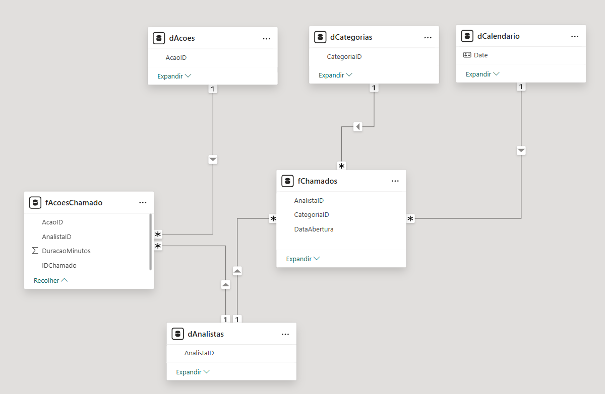

# Dashboard de Desempenho - Central de Atendimento

🔗 **Acesse o dashboard interativo publicado no Power BI aqui:**  
👉 [Dashboard de Desempenho - Central de Atendimento](https://app.powerbi.com/view?r=eyJrIjoiODNhMmQ2YWUtY2ZhOS00YjA3LWI4MTQtMjdkMTAxZTc3NDQ2IiwidCI6IjE0NTkzZjgwLTI2NDEtNDQzYy1hOTAzLWQzNGMyNzE1NDdjYSJ9)

Este projeto simula uma análise realista de uma central de atendimento, utilizando dados operacionais de chamados e ações realizadas por analistas. O objetivo é identificar gargalos, avaliar a performance da equipe e gerar insights visuais por meio de um dashboard interativo no **Power BI**.

---

## Descrição do Projeto

A análise foi realizada a partir de duas bases de dados:

- `Chamados.xlsx`: contendo os chamados abertos por clientes.
- `Detalhes_Chamados.xlsx`: contendo as ações realizadas dentro de cada chamado.

Com essas informações, foi desenvolvido um modelo de dados no Power BI com medidas em DAX e visuais interativos para responder às seguintes perguntas de negócio:

### Perguntas a serem Respondidas pelo Dashboard

1. **Qual categoria apresenta o maior tempo médio de atendimento?**  
    - [Análise segmentada por dias úteis e não úteis.](./conclusao/Abordagem_Respostas.md#Respostas).

2. **Qual analista atendeu ao maior número de chamados?**  
   - [Visual do tipo *ranking* com destaque para o top 3.](./conclusao/Abordagem_Respostas.md#Respostas).

3. **Qual analista possui o menor tempo médio de atendimento?**  
   - [Destaque visual no gráfico de barras e filtro por período.](./conclusao/Abordagem_Respostas.md#Respostas).

4. **Qual tipo de ação acumulou o maior total de minutos de execução?**  
   - [Gráfico de barras com destaque visual no gráfico.](./conclusao/Abordagem_Respostas.md#Respostas).

5. **Como varia o tempo total de atendimento de um chamado conforme o número de ações registradas?**  
   - [Gráfico de dispersão evidenciando correlação.](./conclusao/Abordagem_Respostas.md#Respostas).

---

## Tecnologias e Técnicas Utilizadas

- **Power BI Desktop**  
- **Power Query** para tratamento de dados e criação de colunas derivadas.
- **Modelagem de Dados no Power BI**
  - Os dados foram estruturados a partir de dois arquivos `.xlsx` (Chamados e Detalhes_Chamados) e modelados no Power BI com foco em desempenho e clareza analítica.
  - Adotado o **esquema estrela**, com separação clara entre fatos e dimensões, visando melhor desempenho e facilidade na criação de medidas DAX.
  - **Tabelas fato**:
    - `fChamados`: um registro por chamado, contendo métricas como tempo total de atendimento.
    - `fAcoesChamado`: um registro por ação dentro do chamado, com duração em minutos e referências a dimensões.
  - **Tabelas dimensão**:
    - `dCalendario`: criada com `CALENDAR`, cobrindo o período total dos dados e incluindo indicadores como dias úteis/finais de semana.
    - `dAnalistas`: dados dos analistas responsáveis pelos atendimentos.
    - `dCategorias`: categorias dos chamados, com estrutura hierárquica (CategoriaPai).
    - `dAcoes`: tipos de ações executadas nos chamados.
    - `dChamados`: dimensão auxiliar para ligação entre fatos, se necessário.
  - **Relacionamentos definidos** com base nas chaves: `AnalistaID`, `CategoriaID`, `Data`, `AcaoID` e `ChamadoID`, garantindo consistência na navegação e nos filtros cruzados entre visuais.
"""
- **Medidas DAX** como:
  - `CALCULATE`
  - `AVERAGEX`
  - `RANKX`
  - `SUMX`
  - `DISTINCTCOUNT`
  - `TREATAS`
  - `FILTER`
  - `...`

---

## Insights Relevantes

- A categoria **Conectividade** apresentou o maior tempo médio de atendimento, especialmente em finais de semana — sugerindo a necessidade de reforço operacional ou revisão do SLA nesses períodos.

- O analista **Tyrion** demonstrou o melhor desempenho em agilidade, com o menor tempo médio de atendimento. Pode servir como referência para replicação de boas práticas internas.

- A ação **Intervenção técnica** foi responsável pela maior carga de tempo acumulado. Isso indica oportunidade de automação ou redesenho de processo para aumentar a eficiência.

- Foi identificada uma **relação direta entre o número de ações e o tempo total de atendimento**. Chamados com 4 ações ou mais tendem a durar significativamente mais — o que reforça a necessidade de otimização dos fluxos.

- A adoção do **esquema estrela** e uso de **Power Query (M)** proporcionaram um modelo limpo e performático, facilitando análises rápidas e segmentadas no Power BI.

- A padronização dos dados durante o tratamento evitou distorções analíticas — evidenciando a importância da governança de dados na entrada.

Para mais detalhes e recomendações analíticas, consulte o documento completo:  
[Abordagem_Respostas.md](./conclusao/abordagem_Respostas.md)

---

## Capturas de Tela

  
   
  <em>Figura 1 – Visão geral do dashboard com KPIs principais e filtros interativos.</em>

  
   
  <em>Figura 2 – Ranking dos analistas com destaque visual para os três primeiros colocados.</em>

  
   
  <em>Figura 3 – Relação entre número de ações e tempo de atendimento dos chamados.</em>

  
   
  <em>Figura 4 – Modelo relacional dos dados no Power BI utilizando esquema estrela.</em>

---

## Estrutura do Projeto

-  `pbix/`
    -  [dashboard-central-atendimento.pbip](./pbix/central-atendimento.pbip)
-  `screenshots/`
    -  [analise_acoes_complexidade.png](./screenshots/analise_acoes_complexidade.png)
    -  [overview.png](./screenshots/overview.png)
    -  [top_analistas.png](./screenshots/top_analistas.png)
    -  [modelo_relacional_powerbi.png](./screenshots/modelo_relacional_powerbi.png)
-  `Arquivos/`
    - [Chamados.xlsx](./Arquivos/Chamados.xlsx)
    - [Detalhes_Chamados.xlsx](./Arquivos/Detalhes_Chamados.xlsx)
-  `Conclusão/`
    - [Abordagem_Respostas.md](./Conclusao/Abordagem_Respostas.md)
    - [Abordagem_Respostas.pdf](./Conclusao/Abordagem_Respostas.pdf)
-  [README.md](./README.md)

---

## Design no Figma

Caso queira ver o mockup visual utilizado para inspiração do layout do dashboard, acesse:  
🔗 [Figma - Protótipo do Dashboard](https://www.figma.com/@gilneifreitas)

---

## Autor

**Gilnei Alves de Freitas**  
Analista de Dados Sênior  
🔗[LinkedIn](https://www.linkedin.com/in/gilnei-freitas/) | [Email](mailto:gilnei147@gmail.com)

---

## Licença

Este projeto é de uso demonstrativo para fins de portfólio e aprendizado. Os dados utilizados foram fictícios ou anonimizados.
