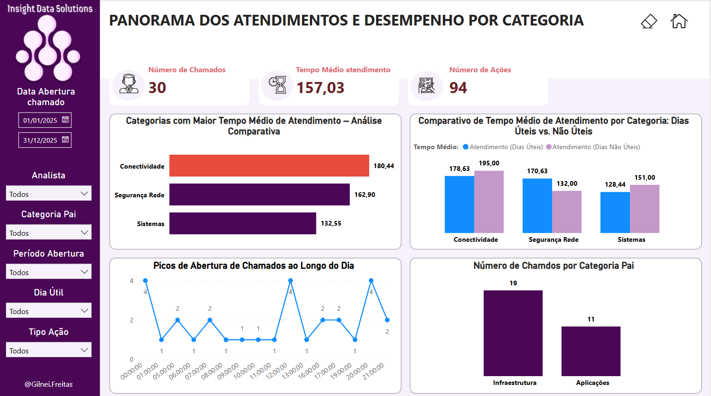
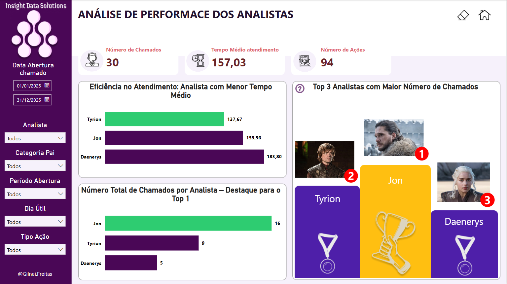

# Dashboard de Desempenho - Central de Atendimento

Este projeto simula uma análise realista de uma central de atendimento, utilizando dados operacionais de chamados e ações realizadas por analistas. O objetivo é identificar gargalos, avaliar a performance da equipe e gerar insights visuais por meio de um dashboard interativo no **Power BI**.

---

## Descrição do Projeto

A análise foi realizada a partir de duas bases de dados:

- `Chamados.xlsx`: contendo os chamados abertos por clientes.
- `Detalhes_Chamados.xlsx`: contendo as ações realizadas dentro de cada chamado.

Com essas informações, foi desenvolvido um modelo de dados no Power BI com medidas em DAX e visuais interativos para responder às seguintes perguntas de negócio:

### Perguntas a serem Respondidas pelo Dashboard

1. **Qual categoria apresenta o maior tempo médio de atendimento?**  

2. **Qual analista atendeu ao maior número de chamados?**  

3. **Qual analista possui o menor tempo médio de atendimento?**  

4. **Qual tipo de ação acumulou o maior total de minutos de execução?**  

5. **Como varia o tempo total de atendimento de um chamado conforme o número de ações registradas?**  

---

## Tecnologias e Técnicas Utilizadas

- **Power BI Desktop**  
- **Power Query** para tratamento de dados e criação de colunas derivadas.
- **Modelagem Relacional**
  - ``
  - ``
  - ``
  - ``
  - ``
- **Medidas DAX** como:
  - `CALCULATE`
  - `AVERAGEX`
  - `RANKX`
  - `SUMX`
  - `DISTINCTCOUNT`
  - `...`

---

## Insights Relevantes

---

## Capturas de Tela

<p align="center">
  
</p>

<p align="center">
  
</p>

---

## Estrutura do Projeto

```
central-atendimento-powerbi/
├── pbix/
│   └── dashboard-central-atendimento.pbip
│       └── central-atendimento.Report
│       └── central-atendimento.SemanticModel
├── screenshots/
│   └── ...
├── Arquivos/
│   └── Chamados.xlsx
│   └── Detalhes_Chamados.xlsx
├── Conclusão/
│   └── Abordagem_Respostas.md
├── README.md
```

---

## Design no Figma

Caso queira ver o mockup visual utilizado para inspiração do layout do dashboard, acesse:  
🔗 [Figma - Protótipo do Dashboard](https://www.figma.com/@gilneifreitas)

---

## Autor

**Gilnei Alves de Freitas**  
Analista de Dados Sênior  
[LinkedIn](https://www.linkedin.com/in/gilnei-alves/) | [Email](mailto:gilnei147@gmail.com)

---

## Licença

Este projeto é de uso demonstrativo para fins de portfólio e aprendizado. Os dados utilizados foram fictícios ou anonimizados.
